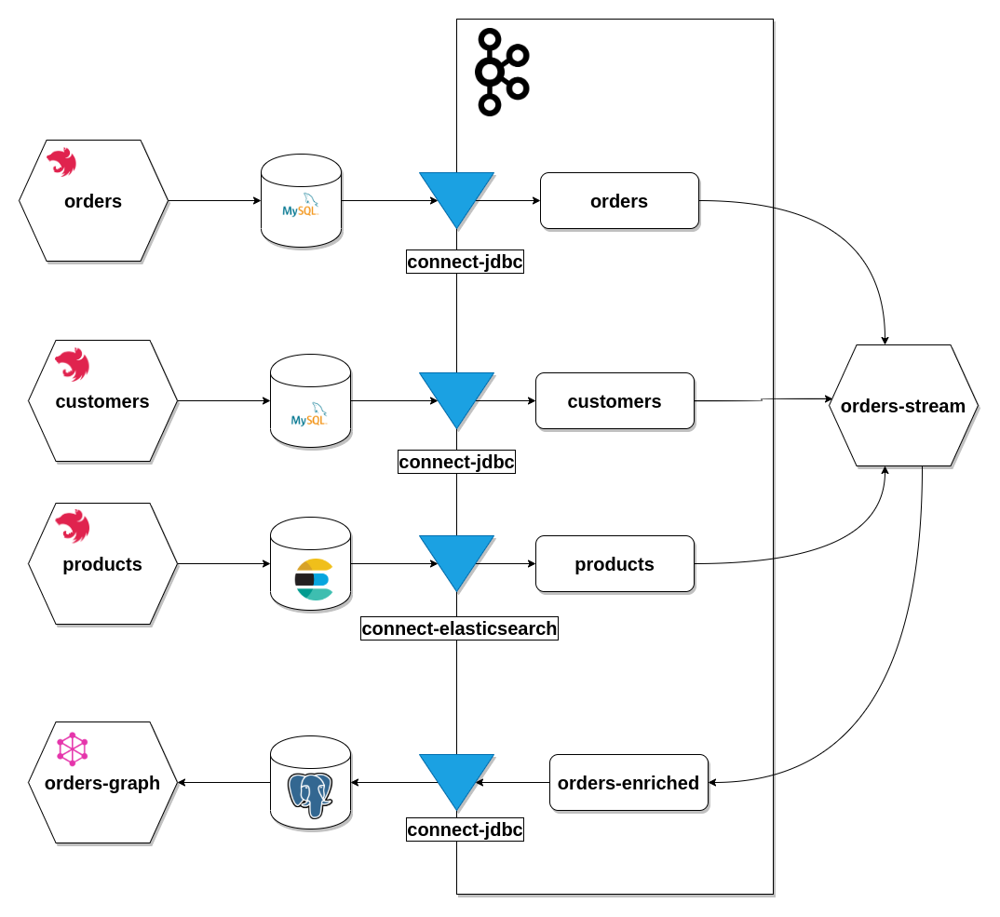

# ORDER-MANAGEMENT-SYSTEM

Ecommerce demo microservice platform, a proof of concept for microservices architecture.



# MICROSERVICES

## CUSTOMERS

Rest based api to handle customer data and delivery addresses backed by MySQL

## PRODUCTS

Rest based api to fetch product catalog backed by elastic search.

## ORDERS

Rest based api to place an order backed by MySQL

## ORDERS-GRAPH

Graphql based api to fetch order information, uses a query model backed by postgres

## ORDERS-STREAM

Kafka streams process to enrich order information and expose them into a read model.

# INFRAESTRUCTURE COMPONENTS

## APACHE KAFKA

Apache kafka serves as the main messaging broker, decouples the comunication between services enssuring scalable 

## APACHE KAFKA CONNECT

Connector used to extract information from the different systems into kafka topics for late stream processing.

## SQL DATABASES

### MYSQL

Main database used for fast and simple operations

### POSTGRESQL

Main database used for more complex data models and scalable models.

## NO SQL DATABASES

### ElasticSearch

Document based & text search database used to index product catalog

# INSTALLING

## REQUIREMENTS

* Docker 19.03.8
* Docker compose 1.21.2
* NPM 6.4.1
* Node v10.14.2
* Java JDK 1.8.0
* Kafka lite Image

Optional:

* Curl or Postman

## START THE ENVIRONMENT

```sh
docker-compose up -d
```

## BUILD THE MICROSERVICES

```sh
# Build orders service
cd orders && npm run build
docker build -t oms-orders:1.0.0 .

# Build customers service
cd customers && npm run build
docker build -t oms-customers:1.0.0 .

# Build products service
cd products && npm run build
docker build -t oms-products:1.0.0 .

# Build orders-graph service
cd orders-graph && npm run build
docker build -t oms-orders-graph:1.0.0 .

# Build orders-stream service
cd orders-stream && ./gradlew build
docker build -t oms-orders-stream:1.0.0 .
```

## CREATE TOPICS 

```sh
# ENTER TO THE KAFKA DOCKER CONTAINER
docker exec -ti order-management-system_kafka_lite_1  sh

./bin/kafka-topics.sh --create --zookeeper localhost:2181 --replication-factor 1 --partitions 3 --topic customer
./bin/kafka-topics.sh --create --zookeeper localhost:2181 --replication-factor 1 --partitions 3 --topic address
./bin/kafka-topics.sh --create --zookeeper localhost:2181 --replication-factor 1 --partitions 3 --topic order
./bin/kafka-topics.sh --create --zookeeper localhost:2181 --replication-factor 1 --partitions 3 --topic order_detail
./bin/kafka-topics.sh --create --zookeeper localhost:2181 --replication-factor 1 --partitions 3 --topic products
./bin/kafka-topics.sh --create --zookeeper localhost:2181 --replication-factor 1 --partitions 3 --topic orders-graph
```

## SUBMIT THE CONNECTORS

To submit the connectors to the kafka connect api

```sh
curl -X POST -H "Content-Type: application/json" -d @./connectors/customers.json http://localhost:8083/connectors
curl -X POST -H "Content-Type: application/json" -d @./connectors/orders.json http://localhost:8083/connectors
curl -X POST -H "Content-Type: application/json" -d @./connectors/products.json http://localhost:8083/connectors
curl -X POST -H "Content-Type: application/json" -d @./connectors/graph.json http://localhost:8083/connectors
```

To validate connectors status:

```sh
curl http://127.0.0.1:8083/connectors/oms-customers/tasks/0/status
curl http://127.0.0.1:8083/connectors/oms-orders/tasks/0/status
curl http://127.0.0.1:8083/connectors/oms-products-sink/tasks/0/status
curl http://127.0.0.1:8083/connectors/oms-graph/tasks/0/status
```
The expected output should be something like:

```json
{"id":0,"state":"RUNNING","worker_id":"localhost:8083"}
```


# ROADMAP

* Implement inventory system(redis based)
* Implement shipping service(backed by event sourcing)
